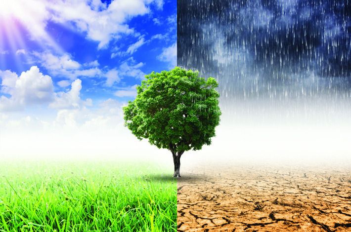

# Klima Kattastrofe

## Om ingenting endred kan kosenvkense være kattastrofale

**Av Jakob, Jeremy og laura Cats**

_Redaktører av Katteposten_

Publisert: 24.01.2025 11:45 | Oppdatert: 03.02.2025 00:41

---

## Global temperatur rekord i januar 2025
Ifølge Copernicus Climate Change Service var januar 2025 den varmeste januar som noen gang hadde blitt registrert globalt. I januar 20205 ble det målt globalt gjennomsnitts luft temperatur på 13.23 grader celsius, dette er 0.79 grader varmere enn januar gjennomsnitts temperaturen mellom 1991 og 2020. 

Dette rammet Europa enda hardere der gjennomsnittstemperaturen i januar 2025 ble målt på 1.80 grader celsius som er 2.52 grader varmere enn gjennomsnittstemperaturen i januar 2025. Dette er andre plass i hvor varmt januar noen gang har vert i Europa som i januar 2020, var 2.64 over gjennomsnittet.

## Klimaendringer truer natur, matforsyning, økosystemer og transport i Europa

Lengere perioder med tørke og rekordhøy varme rammer nå større deler av Europa som skaper alvorlige konsekvenser for landbruk og naturmiljø. Lav vannstand i viktige elver, tørre jordområder og økende press på både miljø og samfunn, selv om det er vår, er det mange tegn på at situasjonen kan blir verre utover sommeren. 

## Tørken i Europa skaper store utfordringer for mat, natur og energi
Ifølge en rapport fra EU Science Hub i mai 2025 har viktige elver som Rhinen fått betydelig lavere vannstand enn normalt. Dette skaper store problemer for elvetransporten, særlig når det gjelder frakt av varer med skip.
Samtidig har mangelen på nedbør ført til at jordene er ekstremt tørre. Mange bønder i Europa sliter med å dyrke mat på vanlig måte, og det er allerede varslet om dårligere avlinger. Dette kan igjen føre til høyere matpriser og større usikkerhet rundt matsikkerhet i flere land.

Også naturen kjenner konsekvensene. Mange økosystemer – både planter og dyr – er avhengige av jevn tilgang på vann for å overleve. Når det blir for tørt over lengre tid, begynner naturen å vise tegn på stress. 

Dette er allerede synlig i flere deler av Europa, og spesielt i områder rundt Middelhavet og Øst-Europa.
I tillegg blir også energiproduksjonen påvirket. Flere land i Europa bruker vannkraft som en viktig energikilde, men når elvene tørker inn, blir det vanskelig å produsere nok strøm. Dette kan skape utfordringer for energiforsyningen og gjøre regionene mer sårbare i møte med økende strømbehov.
Den lave vannstanden rammer også økonomien. Elvene fungerer som viktige transportårer i Europa. Når vannstanden synker, kan ikke skip frakte like mye last som før, noe som fører til forsinkelser, høyere fraktkostnader og økte priser på varer.

Selv om vegetasjonen i mange områder fortsatt ser grønn og sunn ut, advarer eksperter om at dette kan være midlertidig. Tidlig vekst i planter kan skjule sårbarheter som vil bli tydeligere hvis tørken fortsetter. Dersom de tørre forholdene vedvarer gjennom sommeren, vil både landbruk og natur bli ytterligere rammet.

## Hva vi må gjøre?
Selv om klimakrisen ser grå ut, kan vi ikke miste håpet. Vi har fortsatt en sjanse for å redde planeten og fremtiden. Vi kan starte ved å demonstrere mer mot drilling av olje, kutting av trær og storfisking i havet og gjøre det vanskeligere for grådige bedrifter til å utnytte disse ressursene. Vi kan også hjelpe direkte ved å resirkulere, bruke mindre plast og rydde opp søppel på gatene og i naturen.

